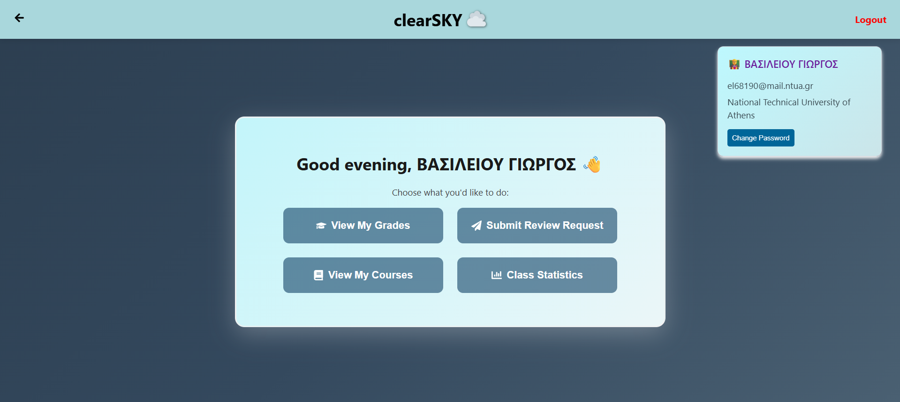
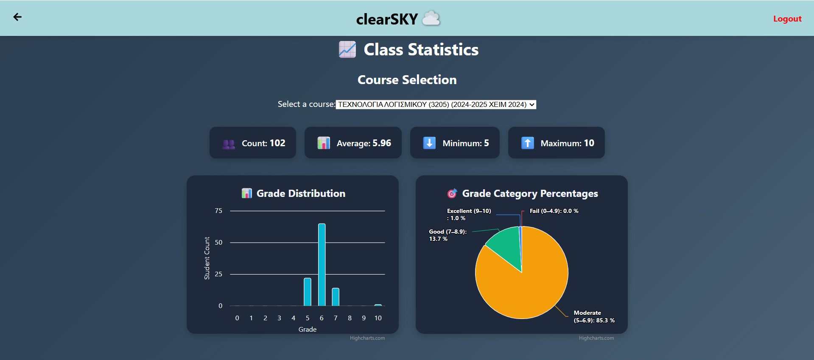

# ☁️ ClearSky — Cloud Grade Management System

**ClearSky** is a cloud-based grade management platform designed for both students and teachers. It was developed as part of the **SaaS 2025** university course and follows a microservice architecture for modularity, scalability, and maintainability.

---

## 🧱 Technologies Used

### Frontend
- React.js
- Tailwind CSS
- Axios

### Backend (Microservices)
- Node.js + Express
- PostgreSQL
- Docker (per service)
- API Gateway 
- RabbitMQ (Message Queue for async communication)

---

## 📁 Project Structure

```text
saas25-24/
│
├── frontend-app/        # React frontend app
├── users-service/       # User management
├── grades-service/      # Grade submission, finalization
├── review-service/      # Review requests and responses
├── stats-service/       # Class Statistics
├── api-gateway/         # Routes all external requests
├── database/            # Review requests and responses
├── architecture/        # UML diagrams and documentation
└── docker-compose.yml   
```

---

## 🚀 Local Execution

1. Clone the repository:
```bash
git clone https://github.com/ntua/saas25-24.git
cd saas25-24
```

2. Start the application:
```bash
docker-compose up --build
```

3. Access:
- Frontend: [http://localhost:3000](http://localhost:3000)
All services are accessible via the API Gateway (localhost:8080).
---

## 👥 User Roles

### Student
- View courses by semester
- View grades by semester
- Submit review requests
- See visualized statistics (pie chart, histogram)

### Teacher
- Upload or finalize grades (via Excel or manually)
- View and respond to review requests
- Access course statistics

---

## 📊 UML Diagrams

- `Class Diagram`: Data models, API interfaces
- `Component Diagram`: Microservices and their responsibilities
- `Sequence Diagram`: System interactions 
- `Deployment Diagram`: Services and ports
- `ER Diagram`: PostgreSQL data structure view

---

## 🐳 Dockerized Architecture

Each microservice runs inside its own container. A single command (`docker-compose`) brings up the entire system with shared networking and environment.

---

### 🐇 RabbitMQ

RabbitMQ is used as a message broker to support asynchronous communication between microservices.  
For example:

- When grades are finalized, an event is published.
- The stats-service listens and updates the class statistics.

RabbitMQ ensures services remain decoupled and scalable.

---

## 📸 Screenshots

<p float="left">
  
  <br />
  
</p>

---

## 👨‍💻 Team

- Fany Kalogianni https://github.com/fanykl
- Alexandra Moraitaki 
- Thanasis Tsiatouras https://github.com/Thanasis-Tsiatouras
- Katerina Bakratsa https://github.com/katerinabakratsa

---
